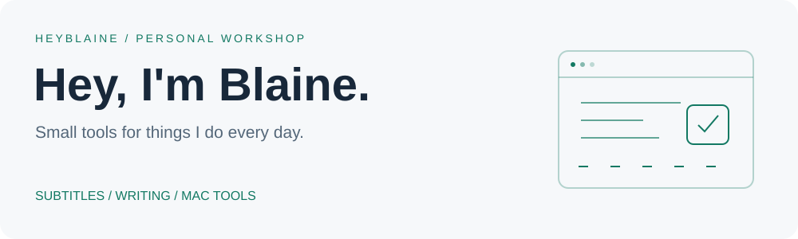
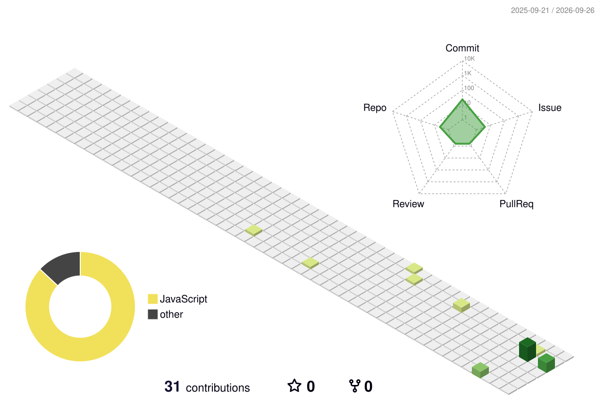

<picture>
  <source media="(max-width: 600px) and (prefers-color-scheme: dark)" srcset="./assets/header-mobile-dark.svg">
  <source media="(max-width: 600px)" srcset="./assets/header-mobile-light.svg">
  <source media="(prefers-color-scheme: dark)" srcset="./assets/header-dark.svg">
  
</picture>

  <a href="https://www.heyblaine.com">Website & writing</a> ·
  <a href="https://github.com/blainehuang1028?tab=repositories">Repositories</a>

做点小工具。围绕字幕、写作和 Mac 上的日常工作，把想法做成能用的东西。

I build tools for subtitles, writing, and everyday work on the Mac.

## Selected projects

### [Subtitle Me](https://github.com/blainehuang1028/subtitle-me)

把带时间轴的英文字幕译成简体中文，统一术语、对照审校，交付适合观看的中文字幕和双语 ASS。

An Agent Skill for reviewed English-to-Chinese subtitles, with project glossaries and bilingual output.

`Agent Skills` · `Subtitle localization` · `Terminology & QA`

[Explore the project →](https://github.com/blainehuang1028/subtitle-me) · [Website](https://skills.heyblaine.com/subtitle-me/)

### [Shotlane](https://github.com/blainehuang1028/shotlane-showcase)

一个原生 Mac 截图工具，把截图、标注、OCR、取色和贴图参考放进同一套工作流程。

A native macOS capture workflow. The public showcase includes product screenshots and engineering notes.

`macOS` · `Local OCR` · `Capture & annotation`

[Product & engineering showcase →](https://github.com/blainehuang1028/shotlane-showcase)

## A little activity

<picture>
  <source media="(prefers-color-scheme: dark)" srcset="./profile-3d-contrib/profile-night-rainbow.svg">
  
</picture>

<picture>
  <source media="(prefers-color-scheme: dark)" srcset="./assets/github-snake-dark.svg">
  
</picture>

Built from GitHub contribution data · refreshed daily

这些小动画是怎么做的？ / How these work

横幅是定制 SVG，贡献图由 GitHub Actions 每天生成。感谢 [snk](https://github.com/Platane/snk) 和 [github-profile-3d-contrib](https://github.com/yoshi389111/github-profile-3d-contrib)。

The banner is a custom animated SVG. GitHub Actions refreshes the contribution animations daily using the projects above.

---

More projects and notes at [heyblaine.com](https://www.heyblaine.com).
